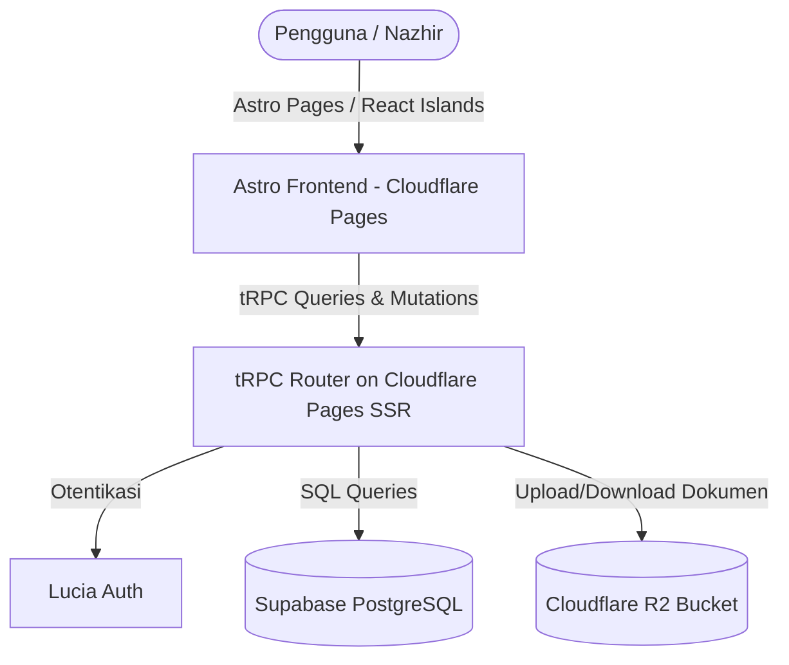
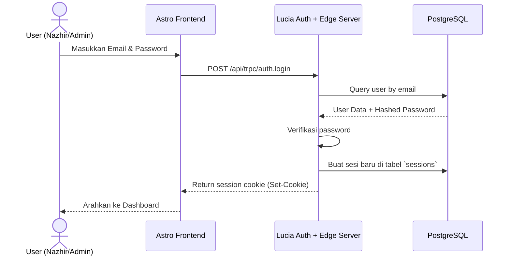
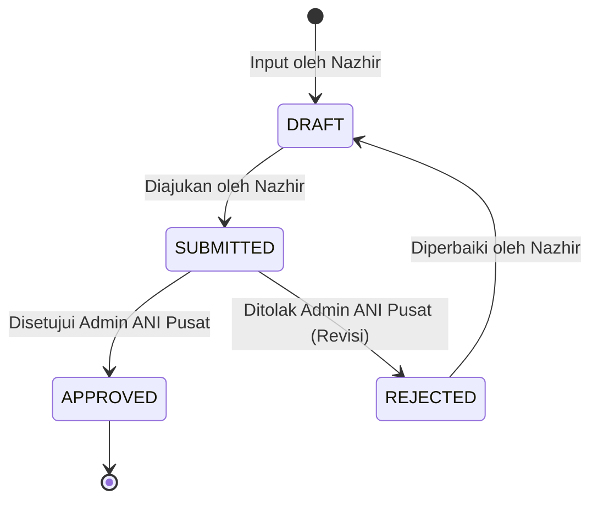

# Functional Specification Document (FSD)
## Dashboard Wakaf Nasional ANI

> Dokumen Spesifikasi Fungsional ini merinci implementasi teknis untuk memenuhi kebutuhan fungsional yang tertuang dalam [Product Requirements Document (PRD)](../Product%20Requirements%20Document%20(PRD)_%20Dashboard%20Wakaf%20Nasional%20ANI.md).

---

## 1. Arsitektur Teknis & Alur Data

Aplikasi ini menggunakan arsitektur monorepo dengan framework **Astro** dideploy ke **Cloudflare Pages** (menggunakan SSR dengan adapter `@astrojs/cloudflare`). Backend terintegrasi menggunakan **tRPC** untuk tipe data yang aman (type-safe) antara frontend dan API Edge.

---

## 2. Skema Database (PostgreSQL / Supabase)

Berikut adalah rancangan tabel database relasional untuk mendukung multi-tenant (tiap lembaga Nazhir adalah satu tenant).

### 2.1 Tabel `nazhir` (Tenants)
Menyimpan informasi profil lembaga Nazhir yang terdaftar di ANI.

| Nama Kolom | Tipe Data | Constraint | Keterangan |
| :--- | :--- | :--- | :--- |
| `id` | `UUID` | PRIMARY KEY, DEFAULT gen_random_uuid() | ID unik lembaga |
| `nama_lembaga` | `VARCHAR(255)` | NOT NULL | Nama resmi lembaga Nazhir |
| `no_reg_bwi` | `VARCHAR(100)` | UNIQUE, NOT NULL | Nomor registrasi Badan Wakaf Indonesia |
| `alamat` | `TEXT` | NOT NULL | Alamat kantor lembaga |
| `telepon` | `VARCHAR(20)` | | Nomor kontak lembaga |
| `status_verifikasi`| `VARCHAR(50)` | NOT NULL, DEFAULT 'PENDING' | `PENDING`, `VERIFIED`, `REJECTED` |
| `created_at` | `TIMESTAMPTZ` | DEFAULT NOW() | Waktu registrasi |

### 2.2 Tabel `users`
Menyimpan data akun pengguna sistem.

| Nama Kolom | Tipe Data | Constraint | Keterangan |
| :--- | :--- | :--- | :--- |
| `id` | `VARCHAR(255)` | PRIMARY KEY | ID dari Lucia Auth |
| `email` | `VARCHAR(255)` | UNIQUE, NOT NULL | Alamat email login |
| `hashed_password` | `VARCHAR(255)` | NOT NULL | Password terenkripsi (Scrypt/Bcrypt) |
| `role` | `VARCHAR(50)` | NOT NULL, DEFAULT 'NAZHIR' | `ADMIN_ANI` (Pusat), `VERIFIKATOR`, `NAZHIR` |
| `nazhir_id` | `UUID` | FOREIGN KEY REFERENCES `nazhir(id)` | NULL jika role adalah `ADMIN_ANI` |
| `created_at` | `TIMESTAMPTZ` | DEFAULT NOW() | Waktu pendaftaran user |

### 2.3 Tabel `sessions` (Lucia Auth)
Diperlukan oleh Lucia Auth untuk manajemen sesi di Edge.

| Nama Kolom | Tipe Data | Constraint | Keterangan |
| :--- | :--- | :--- | :--- |
| `id` | `VARCHAR(255)` | PRIMARY KEY | ID Sesi unik |
| `user_id` | `VARCHAR(255)` | FOREIGN KEY REFERENCES `users(id)` ON DELETE CASCADE | Relasi ke user |
| `expires_at` | `TIMESTAMPTZ` | NOT NULL | Waktu kedaluwarsa sesi |

### 2.4 Tabel `aset_wakaf`
Menyimpan data aset wakaf yang dikelola oleh Nazhir.

| Nama Kolom | Tipe Data | Constraint | Keterangan |
| :--- | :--- | :--- | :--- |
| `id` | `UUID` | PRIMARY KEY, DEFAULT gen_random_uuid() | ID unik aset |
| `nazhir_id` | `UUID` | FOREIGN KEY REFERENCES `nazhir(id)` ON DELETE CASCADE | Relasi ke tenant Nazhir |
| `tipe_aset` | `VARCHAR(50)` | NOT NULL | `TANAH`, `BANGUNAN`, `UANG`, `SURAT_BERHARGA` |
| `nama_aset` | `VARCHAR(255)` | NOT NULL | Nama identifikasi aset |
| `nilai_estimasi` | `NUMERIC(15, 2)` | NOT NULL | Nilai aset dalam Rupiah |
| `luas_tanah` | `NUMERIC(10, 2)` | | Dalam m² (opsional untuk tanah/bangunan) |
| `luas_bangunan` | `NUMERIC(10, 2)` | | Dalam m² (opsional untuk bangunan) |
| `alamat_aset` | `TEXT` | | Lokasi fisik aset |
| `url_sertifikat` | `TEXT` | | Link ke file sertifikat di Cloudflare R2 |
| `status_approval` | `VARCHAR(50)` | DEFAULT 'DRAFT' | `DRAFT`, `SUBMITTED`, `APPROVED`, `REJECTED` |
| `catatan_revisi` | `TEXT` | | Feedback dari Admin ANI jika ditolak |
| `created_at` | `TIMESTAMPTZ` | DEFAULT NOW() | Tanggal input |

### 2.5 Tabel `laporan_keuangan`
Pelaporan berkala (bulanan/tahunan) dari Nazhir.

| Nama Kolom | Tipe Data | Constraint | Keterangan |
| :--- | :--- | :--- | :--- |
| `id` | `UUID` | PRIMARY KEY, DEFAULT gen_random_uuid() | ID unik laporan |
| `nazhir_id` | `UUID` | FOREIGN KEY REFERENCES `nazhir(id)` ON DELETE CASCADE | Relasi ke tenant Nazhir |
| `periode_bulan` | `INT` | NOT NULL | Rentang 1 - 12 |
| `periode_tahun` | `INT` | NOT NULL | Tahun pelaporan (misal: 2026) |
| `total_penerimaan`| `NUMERIC(15, 2)` | NOT NULL | Total kas masuk wakaf baru |
| `total_penyaluran`| `NUMERIC(15, 2)` | NOT NULL | Total penyaluran manfaat |
| `url_dokumen_pdf` | `TEXT` | NOT NULL | Laporan keuangan PDF di Cloudflare R2 |
| `status_approval` | `VARCHAR(50)` | DEFAULT 'SUBMITTED' | `SUBMITTED`, `APPROVED`, `REJECTED` |
| `catatan_revisi` | `TEXT` | | Feedback dari Admin ANI jika ditolak |
| `created_at` | `TIMESTAMPTZ` | DEFAULT NOW() | Tanggal kirim |

### 2.6 Tabel `laporan_dampak_sosial`
Metrik dampak program wakaf terhadap penerima manfaat (*Mauquf Alaih*).

| Nama Kolom | Tipe Data | Constraint | Keterangan |
| :--- | :--- | :--- | :--- |
| `id` | `UUID` | PRIMARY KEY, DEFAULT gen_random_uuid() | ID unik dampak |
| `nazhir_id` | `UUID` | FOREIGN KEY REFERENCES `nazhir(id)` ON DELETE CASCADE | Relasi ke tenant Nazhir |
| `nama_program` | `VARCHAR(255)` | NOT NULL | Nama program pendayagunaan wakaf |
| `jumlah_penerima`| `INT` | NOT NULL, DEFAULT 0 | Jumlah individu penerima manfaat |
| `sektor_dampak` | `VARCHAR(100)` | NOT NULL | `PENDIDIKAN`, `KESEHATAN`, `EKONOMI`, `SOSIAL` |
| `deskripsi_dampak`| `TEXT` | NOT NULL | Penjelasan dampak sosial secara naratif |
| `metrik_tambahan`| `JSONB` | | Metrik khusus (cth: kenaikan pendapatan dsb) |
| `created_at` | `TIMESTAMPTZ` | DEFAULT NOW() | Tanggal input |

---

## 3. Alur Otentikasi & Otorisasi

Otentikasi dikelola menggunakan **Lucia Auth** dengan penyimpanan sesi berbasis tabel `sessions` di database.

### Otorisasi berbasis Peran (Role-Based Access Control)
* **`NAZHIR`**: Hanya bisa melakukan CRUD pada data yang memiliki `nazhir_id` sesuai dengan profil lembaganya. Status awal aset/laporan adalah `DRAFT` atau `SUBMITTED`.
* **`VERIFIKATOR`**: Bisa membaca data seluruh Nazhir di wilayah kerja tertentu, memberikan rekomendasi persetujuan.
* **`ADMIN_ANI`**: Akses penuh ke seluruh data nasional. Melakukan approval/rejection laporan keuangan dan verifikasi registrasi Nazhir baru.

---

## 4. Spesifikasi API (tRPC Router)

### 4.1 `authRouter`
* **`registerNazhir`** (Mutation): Mendaftarkan profil `nazhir` baru sekaligus akun `user` pertama sebagai administrator lembaga tersebut.
* **`login`** (Mutation): Verifikasi kredensial dan set cookie sesi.
* **`logout`** (Mutation): Menghapus sesi aktif dari database dan cookie.
* **`getMe`** (Query): Mengembalikan profil user saat ini beserta data lembaganya.

### 4.2 `nazhirRouter`
* **`getProfile`** (Query): Mengambil data profil lembaga berdasarkan `nazhir_id`.
* **`updateProfile`** (Mutation): Mengedit data profil lembaga (kecuali `no_reg_bwi`).
* **`listNazhir`** (Query) `[ADMIN_ANI/VERIFIKATOR Only]`: Mengambil semua daftar lembaga Nazhir dengan filter status verifikasi.

### 4.3 `asetRouter`
* **`createAset`** (Mutation) `[NAZHIR Only]`: Input aset wakaf baru.
* **`getAsetList`** (Query): Mengambil daftar aset dengan filter tipe, status approval, dan tenant.
* **`approveAset`** (Mutation) `[ADMIN_ANI Only]`: Mengubah status aset menjadi `APPROVED` atau `REJECTED`.

### 4.4 `keuanganRouter`
* **`submitLaporan`** (Mutation) `[NAZHIR Only]`: Mengirim laporan keuangan beserta file PDF dari R2.
* **`getLaporanList`** (Query): Mengambil daftar laporan keuangan berkala.
* **`approveLaporan`** (Mutation) `[ADMIN_ANI Only]`: Mengubah status laporan menjadi `APPROVED` atau `REJECTED` dengan catatan revisi.

### 4.5 `dampakRouter`
* **`submitDampak`** (Mutation) `[NAZHIR Only]`: Mengirim laporan dampak sosial program.
* **`getDampakList`** (Query): Mengambil data dampak sosial untuk ditampilkan di dashboard analitik nasional.

---

## 5. Alur Kerja Persetujuan Laporan (Approval Workflow)

Setiap pengajuan aset wakaf dan laporan keuangan harus melewati siklus persetujuan berikut:

1. **DRAFT**: Data tersimpan secara lokal oleh Nazhir, belum terlihat oleh tim verifikasi ANI.
2. **SUBMITTED**: Data dikunci dari pengeditan oleh Nazhir dan masuk antrean review Admin ANI.
3. **APPROVED**: Laporan disetujui, metrik keuangan/aset dikonsolidasikan ke agregator nasional secara *real-time*.
4. **REJECTED**: Laporan dikembalikan ke status edit dengan kolom `catatan_revisi` yang harus dibenahi oleh Nazhir.
